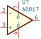

# KiCAD Libraries - Symbols and Footprints

This library contains an assortment of symbols and footprints used in my KiCAD designs. The footprints do not contain any 3D models used in the 3D viewer.

## Symbols

All symbols are located within the [TimGollLin.kicad_sym](./TimGollLib.kicad_sym) file.

### AD817

The AD817 is a low cost, low power, single/dual supply, high speed op amp which is ideally suited for a broad spectrum of signal conditioning and data acquisition applications.

**Datasheet:** https://www.analog.com/media/en/technical-documentation/data-sheets/AD817.pdf

## Footprints
