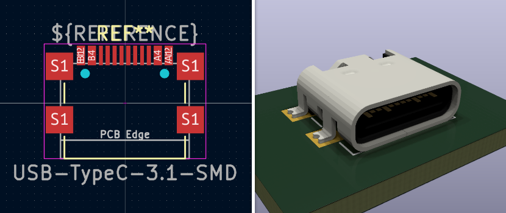
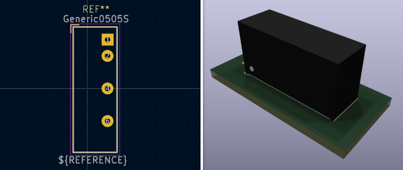
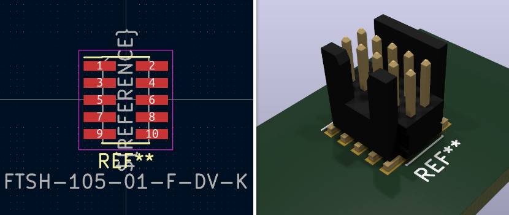
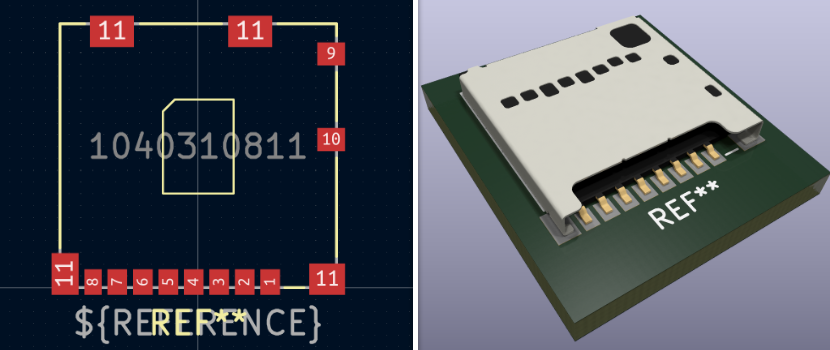

# KiCAD Libraries - Symbols and Footprints

This library contains an assortment of symbols and footprints used in my KiCAD designs. The footprints do not contain any 3D models used in the 3D viewer.

## Note on 3D models

To use the provided 3D models in this library, you need to create an environment variable on the 3d folder path.

- Open `Preferences` -> `Configure Paths...`
- Create the new variable:
  - Name: `TIMGOLLLIB_FOOTPRINTS`
  - Path: <PATH_TO_THE_3D_FOLDER>

## Symbols

All symbols are located within the [TimGollLin.kicad_sym](./TimGollLib.kicad_sym) file.

### AD817

The AD817 is a low cost, low power, single/dual supply, high speed op amp which is ideally suited for a broad spectrum of signal conditioning and data acquisition applications.

**Datasheet:** https://www.analog.com/media/en/technical-documentation/data-sheets/AD817.pdf

## Footprints

### Tie Hook

A basic tie hook that can be used to connect an oscilloscope probe or as a hook for an cable tie. It is modeled after [this hook](https://jlcpcb.com/partdetail/Ronghe-RH5019/C5199800).

[[3d model file]](3d_model_source/tie-hook.FCStd)

### LDD-700LS

An off the shelf 700mA LED driver package by Meanwell.

[[external 3d model source]](https://ms.componentsearchengine.com/detail.html?searchString=LDD-700LS&manuf=Mean%20Well&country=GB&language=en&source=1) // [[3d model file]](3d_model_source/LDD-700LS.FCStd)

### Generic LED XSSY 3.9x3.9

A generic footprint for XSSY SMD LEDs.

[[3d model file]](3d_model_source/XSSY_3.9x3.9.FCStd)

### OLED 128x64 ZIF connector

A footprint for an OLED display with ZIF connector [like this one](https://www.buydisplay.com/blue-128x64-0-96-inch-oled-display-top-contact-connector-fpc-ssd1306).

[[3d model file]](3d_model_source/128x64_oled_display_1.6mm.FCStd)

### TC2030

Footprint for a [TagConnect 2030](https://www.tag-connect.com/product/tc2030-ctx-stdc14-for-use-with-stm32-processors-with-stlink-v3) programming port on the PCB.

### USB Type-C 3.1

A Footprint for a typical USB 3.1 Type-C receptacle.

[[external 3d model source]](https://grabcad.com/library/usb-type-c-smd-12pin-smd-1) // [[3d model file]](3d_model_source/USB_type_C_smd_12ps038.FCStd)

### Generic 0505S

A generic 0505S isolated DC/DC converter housing that is compatible with modules such as [this one](https://www.lcsc.com/product-detail/Power-Modules_JETEKPS-IF0505S-2W_C5198685.html) or [this one](https://www.tracopower.com/de/deu/model/tmv-0505s).

[[3d model file]](3d_model_source/Generic_0505S.FCStd)

### FTSH-105-01-F-DV-K

A 1.27mm IDC receptacle with the minimal shrouding to make sure the connector can only be plugged in one way. Is a perfect receptacle for a programming interface.

[[external 3d model source]](https://www.samtec.com/de/products/ftsh-105-01-l-dv-k) // [[3d model file]](3d_model_source/FTSH-105-01-F-DV-K.FCStd)

### X8821WRS-03-9TSN

A 3-pin JST compatible SMD connector. The pitch is a bit smaller (2.5mm instead of 2.54mm) but it works for 2 or 3 pins wide connectors.

[[external 3d model source]](https://www.helloxkb.com/Home/Goods/goodsInfo/id/8209/canmes_three/1) // [[3d model file]](3d_model_source/X8821WRS-03-9TSN.FCStd)

### Wcon 2321-210MG0CUNR1

A very low profile 1.27mm pitch pin socket. To achieve such low profile, this connector needs cutouts in the PCB below.

[[3d model file]](3d_model_source/Wcon_2321-210MG0CUNR1.FCStd)

### 10 Pin 2.54mm Shrouded Pin Header

Used for programmers like the STLink v2 clones. It is a useful connector because it is based on standard connectors with the optional added polarity protection.

[[3d model file]](3d_model_source/pinheader_shrouded_10.FCStd)

### BNC50 Right Angle Connector

A BNC connector like [this one](https://www.lcsc.com/product-detail/RF-Connectors-Coaxial-Connectors_dosinconn-DOSIN-801-0050_C521210.html) that can be mounted on a PCB.

[[external 3d model source]](https://www.traceparts.com/de/product/allied-electronics-automation-te-connectivity-right-angle-50o-through-hole-bnc-connector-jack-solder-termination-nickel?CatalogPath=TRACEPARTS%3ATP10016001003005&Product=10-11012018-142936&PartNumber=5-1634513-1) // [[3d model file]](3d_model_source/BNC_50_right_angle_connector.FCStd)

### SMA Female Straight Connector

A SMA connector like [this one](https://www.lcsc.com/product-detail/RF-Connectors-Coaxial-Connectors_BAT-WIRELESS-BWSMA-KE-Z001_C496549.html) that can be mounted on a PCB.

[[external 3d model source]](https://www.traceparts.com/de/product/rs-components-sma-smajack-gerade-50o-lotenanschluss-leiterplattenmontage?CatalogPath=TRACEPARTS%3ATP10016001003017&Product=10-08112019-128027&PartNumber=73251-3140) // [[3d model file]](3d_model_source/SMA_female_straight_pcb.FCStd)

### TE MicroMaTch 8-338069-0

A keyed self-locking board-to-wire [conenctor from TE](https://www.lcsc.com/product-detail/Wire-To-Board-Wire-To-Wire-Connector_TE-Connectivity-8-338069-0_C306129.html).

[[external 3d model source]](https://www.te.com/de/product-8-338069-0.html) // [[3d model file]](3d_model_source/TE_MicroMaTch_8-338069-0.FCStd)

### Relay HF33F - Type C

Based on KiCad's `Relay_SPDT_Omron-G5Q-1` footprint this updated version features a 3D model.

[[3d model file]](3d_model_source/Relay_HF33F_C.FCStd)

### Mouser microSD

Micro SD card reader with a spring holder.

[[external 3d model source]](https://www.mouser.de/ProductDetail/Molex/104031-0811?qs=udsGRKD4nA3Tvy7wqky%252BuA%3D%3D) // [[3d model file]](3d_model_source/mouser_microSD_1040310811.FCStd)

## Standard Colors

To make it consistent there are standard colors:

| | R | G | B |
|---|---|---|---|
| Leads | 210 | 209 | 199 |
| Mold Resin | 38 | 37 | 37 |
| Beige Plastic | 228 | 227 | 207 |
| Gold Flashing | 219 | 188 | 126 |
| TE Red | 255 | 55 | 55 |

All colors are extracted from the [original KiCAD 3D models](https://kicad.github.io/packages3d/).
