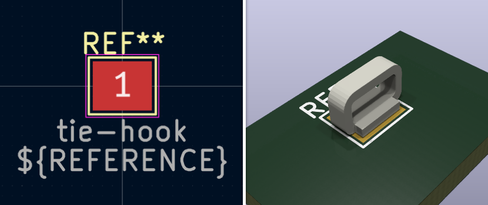

# KiCAD Libraries - Symbols and Footprints

This library contains an assortment of symbols and footprints used in my KiCAD designs. The footprints do not contain any 3D models used in the 3D viewer.

## Note on 3D models

To use the provided 3D models in this library, you need to create an environment variable on the 3d folder path.

- Open `Preferences` -> `Configure Paths...`
- Create the new variable:
  - Name: `TIMGOLLLIB_FOOTPRINTS`
  - Path: <PATH_TO_THE_3D_FOLDER>

## Symbols

All symbols are located within the [TimGollLin.kicad_sym](./TimGollLib.kicad_sym) file.

### AD817

The AD817 is a low cost, low power, single/dual supply, high speed op amp which is ideally suited for a broad spectrum of signal conditioning and data acquisition applications.

**Datasheet:** https://www.analog.com/media/en/technical-documentation/data-sheets/AD817.pdf

## Footprints

### Tie Hook

A basic tie hook that can be used to connect an oscilloscope probe or as a hook for an cable tie. It is modeled after [this hook](https://jlcpcb.com/partdetail/Ronghe-RH5019/C5199800).

### LDD-700LS

An off the shelf 700mA LED driver package by Meanwell.

[[external 3d model source]](https://ms.componentsearchengine.com/detail.html?searchString=LDD-700LS&manuf=Mean%20Well&country=GB&language=en&source=1)

### Generic LED XSSY 3.9x3.9

A generic footprint for XSSY SMD LEDs.

### OLED 128x64 ZIF connector

A footprint for an OLED display with ZIF connector [like this one](https://www.buydisplay.com/blue-128x64-0-96-inch-oled-display-top-contact-connector-fpc-ssd1306).

[[3d model file]](3d_model_source/128x64_oled_display_1.6mm.FCStd)

### TC2030

Footprint for a [TagConnect 2030](https://www.tag-connect.com/product/tc2030-ctx-stdc14-for-use-with-stm32-processors-with-stlink-v3) programming port on the PCB.

### USB Type-C 3.1

A Footprint for a typical USB 3.1 Type-C receptacle.

[[external 3d model source]](https://grabcad.com/library/usb-type-c-smd-12pin-smd-1)

### Generic 0505S

A generic 0505S isolated DC/DC converter housing that is compatible with modules such as [this one](https://www.lcsc.com/product-detail/Power-Modules_JETEKPS-IF0505S-2W_C5198685.html) or [this one](https://www.tracopower.com/de/deu/model/tmv-0505s).

[[3d model file]](3d_model_source/Generic_0505S.FCStd)
